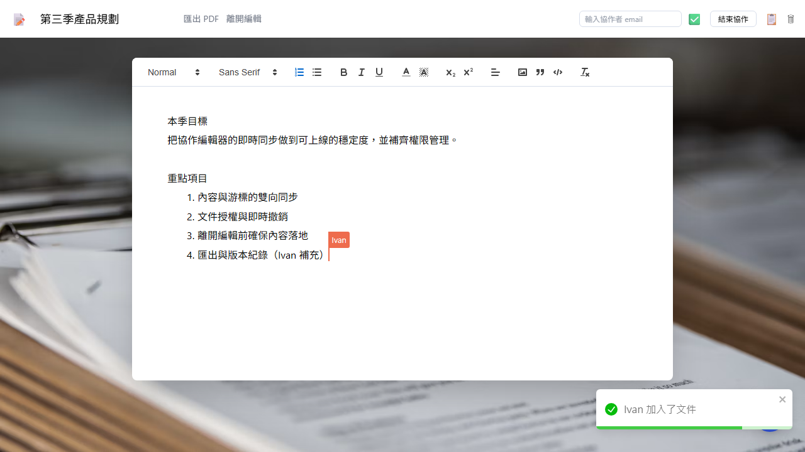
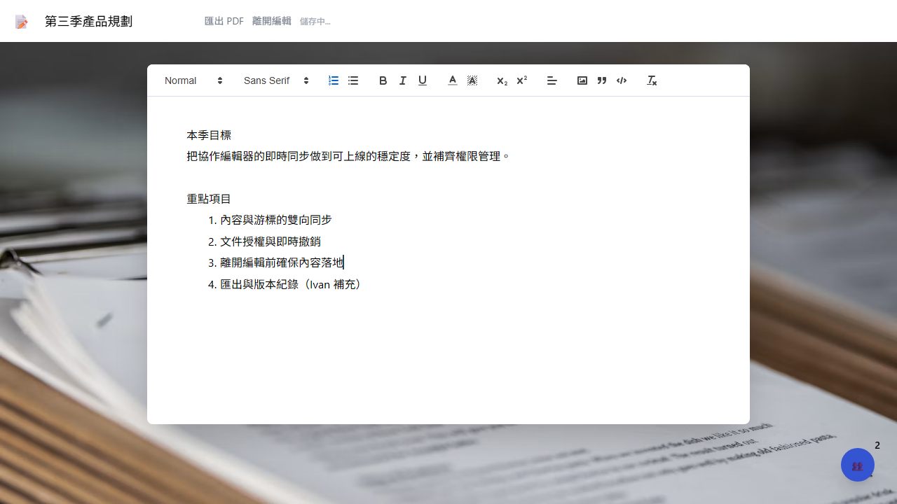
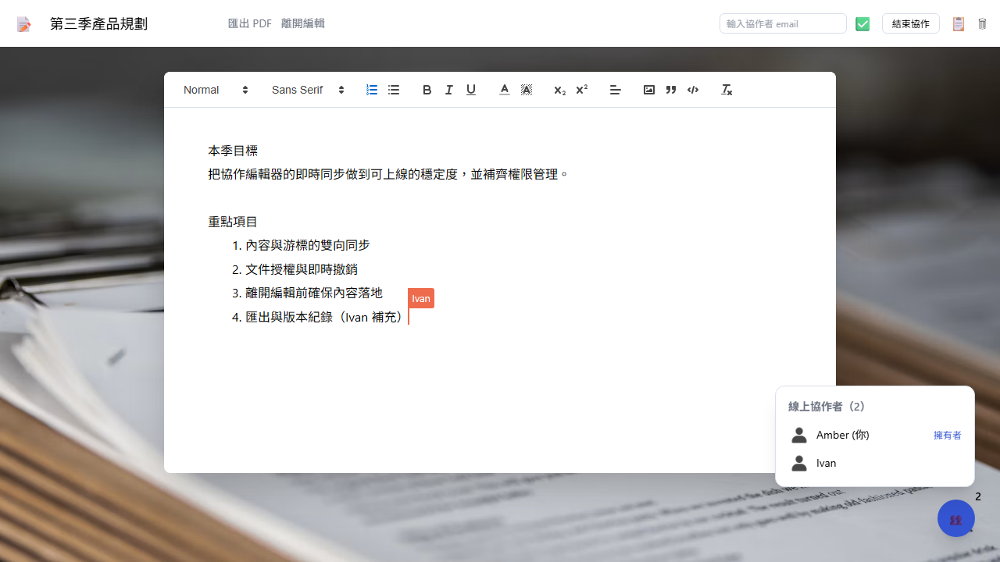
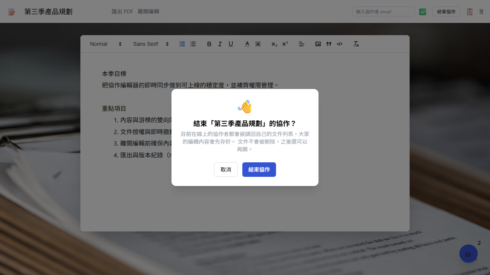
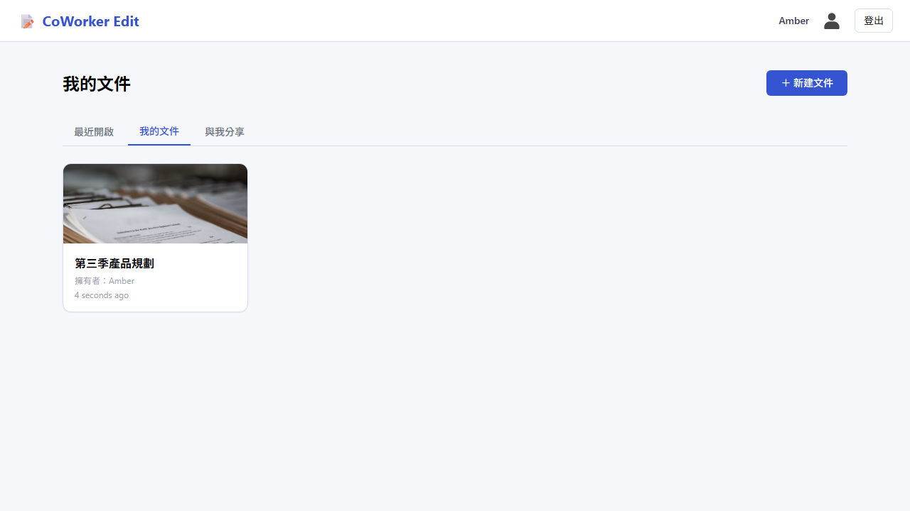
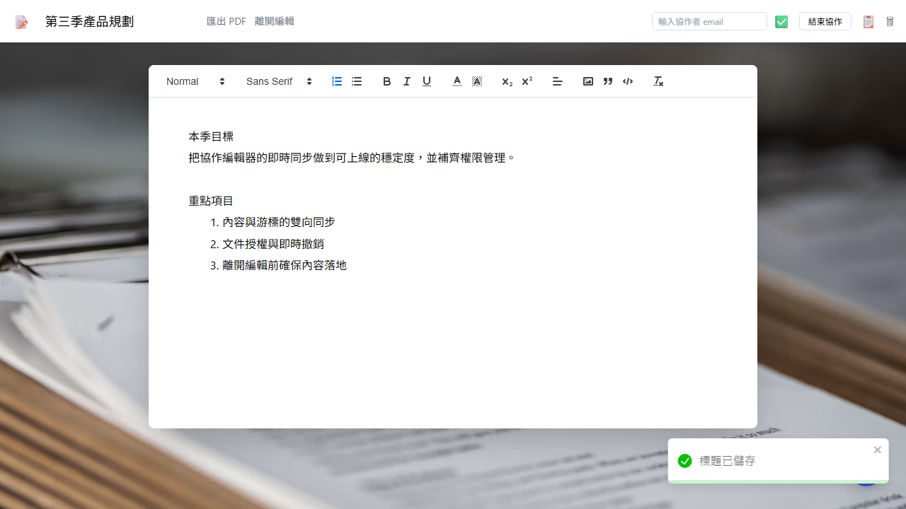
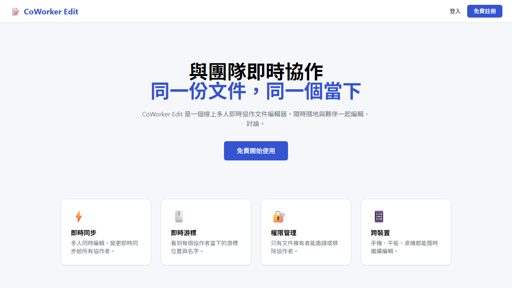
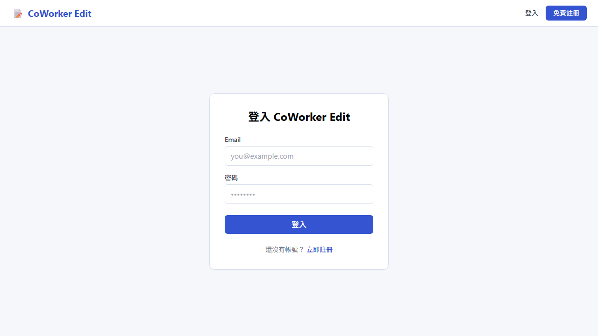

# CoWorker Edit

線上多人即時協作文件編輯器。多人同時編輯同一份文件，內容與游標即時同步。

**技術棧**：FastAPI · python-socketio · MongoDB (Beanie ODM) · React 18 · Vite · Quill · Redux Toolkit · Tailwind CSS

---

## 畫面

### 兩人同時編輯，內容與游標即時同步

左邊是文件擁有者 Amber 的畫面 —— Ivan 補上第 4 點的瞬間就同步過來，並顯示他的游標位置與名稱旗標。

| 擁有者視角 | 協作者視角 |
|---|---|
|  |  |

### 線上協作者名單與結束協作

| 誰在線上 | 擁有者結束協作 |
|---|---|
|  |  |

### 文件列表與編輯器

| 我的文件 | 編輯器 |
|---|---|
|  |  |

### 首頁與登入

| 首頁 | 登入 |
|---|---|
|  |  |

> 以上截圖由 `frontend/e2e/screenshots.spec.js` 自動產生，
> 跑 `npx playwright test screenshots.spec.js` 即可重新產出。

---

## 功能

- **JWT 身分驗證** — socket.io 在**連線當下**就驗 token，之後所有事件都以該身分為準，客戶端無法冒充他人
- **即時協作** — 內容雙向同步、游標位置與名稱旗標、線上協作者名單
- **文件權限** — 擁有者可授權 / 移除協作者，移除後對方畫面立即鎖住
- **離開與結束** — 「離開編輯」讓自己退出；擁有者可「結束協作」請所有人回到各自的文件列表，兩者都會先確保內容落地
- **文件管理** — 最近開啟、我的文件、與我分享三種檢視；標題即時同步；匯出 PDF

## 架構重點

REST 與 socket.io **共用同一個 port**。`socketio.ASGIApp` 包住 FastAPI 實例，socket.io 掛在 `/socket.io/`：

```python
# backend/app/main.py
socket_app = socketio.ASGIApp(sio, other_asgi_app=app)
```

> ⚠️ 啟動時進入點必須是 **`app.main:socket_app`**，不是 `app.main:app`。
> 寫成後者 REST 會正常，但**即時協作會完全失效且不會報錯**，非常難查。

---

## 環境需求

| 項目 | 版本 |
|---|---|
| Python | 3.12+ |
| Node.js | 18+ |
| MongoDB | 本機或 MongoDB Atlas 皆可 |

## 安裝與啟動

### 後端

```bash
cd backend
python -m venv .venv && source .venv/bin/activate   # Windows: .venv\Scripts\activate
pip install -r requirements.txt

cp .env.example .env        # 依實際環境填寫
uvicorn app.main:socket_app --port 8000 --reload
```

`backend/.env`：

| 變數 | 說明 | 預設 |
|---|---|---|
| `DB_CONNECT` | MongoDB 連線字串 | `mongodb://localhost:27017` |
| `DB_NAME` | 資料庫名稱 | `coedit` |
| `JWT_SECRET` | JWT 簽章密鑰，**正式環境務必換掉** | — |
| `JWT_ALGORITHM` | 簽章演算法 | `HS256` |
| `JWT_EXPIRE_MINUTES` | Token 有效期（分鐘） | `10080`（7 天）|
| `CLIENT_ORIGIN` | 允許的前端來源（CORS + socket.io）| `http://localhost:3000` |

### 前端

```bash
cd frontend
npm install
cp .env.example .env
npm run dev
```

前端跑在 `http://localhost:3000`。

---

## API

### REST

| 方法 | 路徑 | 說明 |
|---|---|---|
| `POST` | `/api/auth/signup` | 註冊 |
| `POST` | `/api/auth/login` | 登入，回傳 JWT |
| `GET` | `/api/doc/recentlyOpened` | 最近開啟（最多 20 筆）|
| `GET` | `/api/doc/mydoc` | 我建立的文件 |
| `GET` | `/api/doc/shared` | 別人分享給我的文件 |
| `GET` | `/api/doc/users/{doc_id}` | 協作者名單（限擁有者）|
| `GET` | `/api/doc/{doc_id}` | 取得文件，不存在則建立 |
| `PATCH` | `/api/doc/access` | 授權協作者 |
| `PATCH` | `/api/doc/remove` | 移除協作者 |
| `DELETE` | `/api/doc/{doc_id}` | 刪除文件（限擁有者）|
| `GET` | `/api/health` | 健康檢查 |

啟動後可在 `http://localhost:8000/docs` 看互動式文件。

### Socket.io 事件

**Client → Server**

| 事件 | 說明 |
|---|---|
| `get-document` | 加入文件房間 |
| `send-changes` | 廣播本地編輯的 delta |
| `send-cursor` | 廣播游標位置 |
| `save-document` | 存檔（回 ack）|
| `save-title` | 改標題（回 ack）|
| `delete-user` | 移除協作者（限擁有者）|
| `end-session` | 結束協作（限擁有者，回 ack）|
| `delete-doc` | 文件已刪除，踢掉整個房間 |

**Server → Client**

| 事件 | 說明 |
|---|---|
| `document-ready` | **已加入房間**，前端要收到這個才開放編輯 |
| `receive-changes` / `receive-cursor` | 他人的編輯 / 游標 |
| `just-joined` / `just-left` / `all-users` | 線上狀態 |
| `send-title` | 標題被他人修改 |
| `remove-user` | 你的權限被移除 |
| `session-ended` | 擁有者結束了協作 |

> `document-ready` 不是可有可無的通知。後端要跑數趟資料庫查詢才會把 sid 記進房間，
> 在那之前送出的編輯與標題**會被靜默丟棄**。前端必須等這個事件才 `quill.enable()`。

---

## 測試

### 後端（pytest）

```bash
cd backend
pytest
```

涵蓋 API 認證、文件權限、schema 與 security 工具。

### 端對端（Playwright）

```bash
cd frontend
npx playwright test                    # 全部
npx playwright test --headed           # 看得到瀏覽器
npx playwright test -g "標題修改"       # 指定測試
```

> Playwright 設定裡**沒有** `webServer`，執行前請先自行啟動前後端。
>
> e2e 測試沒有清理機制，每輪都會在資料庫留下 `@e2etest.com` 的帳號與文件。
> 建議測試時用獨立的 `DB_NAME`（例如 `coedit_e2e`）與正式資料隔離。

---

## 專案結構

```
backend/
  app/
    main.py           # FastAPI + socket.io ASGI 組裝
    config.py         # pydantic-settings 讀 .env
    db.py             # Beanie 初始化
    core/security.py  # JWT 簽發與驗證、密碼雜湊
    models/           # User / Document
    routers/          # auth / doc REST 路由
    schemas/          # 請求與回應模型
    sockets/events.py # 所有即時協作事件
  tests/

frontend/
  src/
    components/
      Editor.jsx      # 協作編輯器主體
      portal/         # Delete / EndSession / UserList / OnlineList
      user/           # Dashboard / Docs / DocCard
      auth/           # Login / Signup
    redux/            # Redux Toolkit auth slice
    services/         # axios API 封裝
  e2e/                # Playwright 測試
```

### 產生 README 截圖

```bash
cd frontend
npx playwright test screenshots.spec.js     # 產出到 ../docs/
```

這支不是驗證用的測試，是文件產生器。它會建立示範帳號與文件，跑完記得清理。
